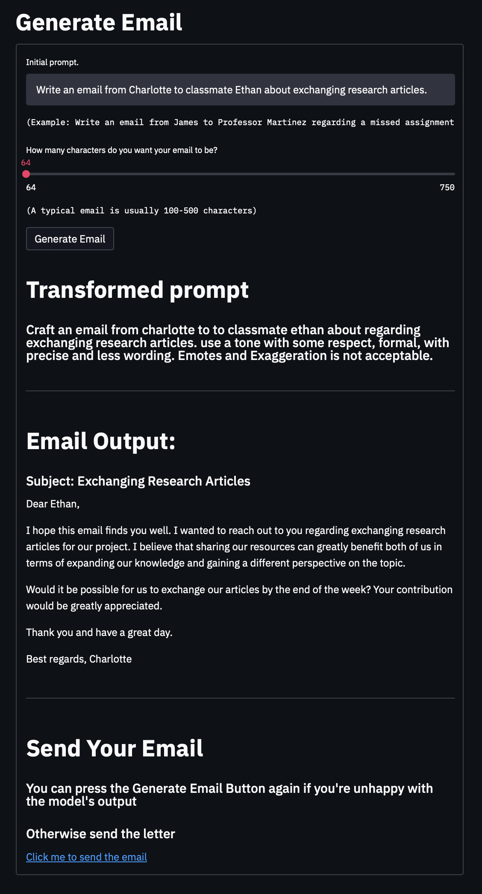

[click me to get our LLM model](https://drive.google.com/file/d/1INZNM3fpzg6O4s2aF7M3XMYbg3xV3DMh/view?usp=sharing)

The model will be available on the GitHub repo after 4 days, due to bandwidth restriction of Git LFS Data. (Today is 20240611, 2325)

After downloading, move the model into ``` cd <repository_directory> ``` that you are going to clone.

Also, if TA need an API key, TA can ask 110550205 for it, since openAI will detecte and disable a compromised key.

# Interactive Email Generator App

## DEMO

You can access the live demo of the Interactive Email Generator App [here](http://proxmoxch.duckdns.org). (It is not available right now)

## Description

This application is designed to help university students generate emails with the perfect tone, tailored to different recipients. With the growing popularity of GPT-3.5-turbo-instruct, many users have turned to AI for drafting emails. However, AI-generated emails can often be easily identified. Our application leverages GPT-3.5-turbo-instruct to generate personalized emails that consider the recipient, ensuring a professional tone and natural flow. Users can configure their email settings directly within the app and generate emails formatted for easy sending via Gmail.

## Authors

- 110550205 - 蕭朝
- 112550028 - 何柏翰
- 112550054 - 陳奕均

## Features

- Configure Streamlit email settings directly within the app.
- Generate personalized emails with a professional tone using GPT-3.5-turbo-instruct.
- Automatically format emails for sending via Gmail.

## Setup Instructions

### Prerequisites

- Python 3.x
- pip

### Installation

1. **Clone the repository:**

   ```sh
   git clone <repository_url>
   cd <repository_directory>
   ```

2. **Install required packages:**

   ```sh
   pip install -r requirements.txt
   ```

3. **Add OpenAI API Key of GPT-3.5-turbo-instruct:**

   - Open the file named `PutYourAPIKeyInThisFile.txt` located in the root directory of the repository.
   - Paste your OpenAI API key into this file and save it.
   - If TA need a key, TA can ask 110550205 for it.

4. **Run the setup script:**

   Ensure that the script `setup.sh` is executable. If not, make it executable:

   ```sh
   chmod +x setup.sh
   ```

   Execute the setup script with your email address:

   ```sh
   ./setup.sh your_email@example.com
   ```

### Running the Application

To start the Streamlit application, execute the following command:

```sh
streamlit run emailapp.py
```

### Using the Application

1. **Configure Email:**

   - Enter your email address in the provided input field and click "Set Email Configuration."

2. **Generate Email:**

   - Provide the initial prompt for the email.
   - Use the slider to specify the desired length of the email.
   - Click "Generate Email" to create a personalized email.

3. **Send Email:**

   - Review the generated email.
   - If satisfied, click the provided link to send the email via Gmail.

## Example Usage

1. Start the application:

   ```sh
   streamlit run emailapp.py
   ```

2. In your browser, enter your email address in the "Configure Email" section and click "Set Email Configuration."

3. Provide the initial prompt, for example:
   
   ```
   Write an email from James to Professor Martinez regarding a missed assignment deadline.
   ```

4. Adjust the slider to your preferred email length and click "Generate Email."

5. Review the generated email. If you are satisfied with the content, click the "Click me to send the email" link to open Gmail with the email pre-filled.

## Hyperparameters for Transforming into a Better Prompt

To transform the initial prompt into a better prompt, we used the following hyperparameters for training our model:

- **Batch Size:** 2
- **Learning Rate:** 2e-5
- **Epochs:** 10

These hyperparameters were chosen to balance the model's performance and training time, ensuring that the generated prompts are both accurate and contextually appropriate.

## Experimental Results

### Initial Prompt
**Prompt:**  
"Write an email from Charlotte to classmate Ethan about exchanging research articles.”

### Final Prompt
**Transformed Prompt:**  
“Craft an email from Charlotte to classmate Ethan about regarding exchanging research articles. Use a tone with some respect, formal, with precise and less wording. Emotes and Exaggeration is not acceptable.”

### Generated Email
**Output:**

```
Subject: Exchanging Research Articles

Dear Ethan,

I hope this email finds you well. I wanted to reach out to you regarding exchanging research articles for our project. I believe that sharing our resources can greatly benefit both of us in terms of expanding our knowledge and gaining a different perspective on the topic.

Would it be possible for us to exchange our articles by the end of the week? Your contribution would be greatly appreciated.

Thank you and have a great day.

Best regards,
Charlotte
```

### Explanation

- **Initial Prompt:** The initial prompt provided a basic idea of the email content but lacked specific details and tone.
- **Final Prompt:** The final transformed prompt included additional instructions about the tone and formality, ensuring the email is respectful and precise.
- **Generated Email:** The generated email successfully followed the instructions from the final prompt, producing a well-structured and professional email. The subject was correctly formatted, and the body of the email maintained a formal tone without emotes or exaggeration.

### Screenshot


This screenshot shows the generated email based on the given initial and final prompts.

## Troubleshooting

- **Port Issues:** If you encounter issues with the application running on port 80, ensure you have the necessary permissions. You may need to run the application with `sudo`:
  
  ```sh
  sudo streamlit run emailapp.py
  ```

- **Dependencies:** Ensure all dependencies are installed correctly. If you encounter any missing packages, try reinstalling them using:
  
  ```sh
  pip install -r requirements.txt
  ```

## Contribution

Feel free to fork this repository, make modifications, and submit pull requests. For significant changes, please open an issue first to discuss what you would like to change.

## License

This project is licensed under the MIT License. See the LICENSE file for details.

